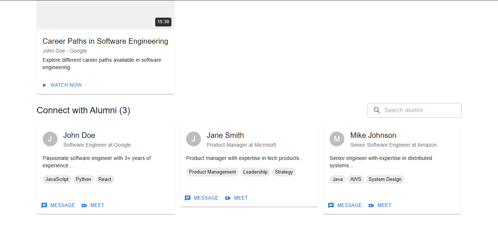

# 🎓 Alumni Connect - MERN Stack Platform

A comprehensive web platform connecting students and alumni for mentorship, networking, and career development. Built with the MERN stack (MongoDB, Express.js, React.js, Node.js) and real-time communication features.

## 🌟 Features

### Core Functionality
- **User Authentication & Authorization** - Secure JWT-based authentication
- **User Profiles** - Detailed profiles for students and alumni
- **Real-time Chat** - Instant messaging with Socket.io
- **Video Calling** - WebRTC-based video communication
- **Meeting Scheduling** - Plan and organize mentorship sessions
- **Notifications** - Real-time push notifications
- **Admin Dashboard** - Administrative controls and user management
- **File Sharing** - Upload and share documents/videos

### Advanced Features
- **Mentorship Matching** - Connect students with relevant alumni
- **Career Guidance** - Professional development resources
- **Event Management** - Alumni events and workshops
- **Networking Hub** - Professional networking opportunities
- **Success Stories** - Alumni achievement showcases

## 🛠️ Tech Stack

### Backend
- **Node.js** - Runtime environment
- **Express.js** - Web application framework
- **MongoDB** - NoSQL database
- **Mongoose** - MongoDB object modeling
- **Socket.io** - Real-time bidirectional communication
- **JWT** - JSON Web Tokens for authentication
- **Bcrypt** - Password hashing
- **Multer** - File upload handling
- **Nodemailer** - Email service

### Frontend
- **React.js** - Frontend library
- **Socket.io Client** - Real-time communication
- **Axios** - HTTP client
- **React Router** - Client-side routing

## 📁 Project Structure

```
Synapse_QuaJ/
├── backend/
│   ├── middleware/
│   │   └── auth.js          # Authentication middleware
│   ├── routes/
│   │   ├── auth.js          # Authentication routes
│   │   ├── users.js         # User management routes
│   │   ├── chat.js          # Chat functionality routes
│   │   ├── meetings.js      # Meeting scheduling routes
│   │   ├── videos.js        # Video sharing routes
│   │   ├── notifications.js # Notification routes
│   │   └── admin.js         # Admin panel routes
│   ├── models/              # Database models
│   ├── utils/               # Utility functions
│   ├── server.js            # Main server file
│   └── package.json         # Backend dependencies
├── frontend/                # React frontend (to be added)
└── README.md               # Project documentation
```

## 🚀 Quick Start

### Prerequisites
- Node.js (v14 or higher)
- MongoDB (local or Atlas)
- npm or yarn

### Installation

1. **Clone the repository**
   ```bash
   git clone https://github.com/poovarasansivakumar2003/Synapse_QuaJ.git
   cd Synapse_QuaJ
   ```

2. **Backend Setup**
   ```bash
   cd backend
   npm install
   ```

3. **Environment Variables**
   Create a `.env` file in the backend directory:
   ```env
   MONGODB_URI=mongodb://localhost:27017/Synapse_QuaJ
   JWT_SECRET=your_jwt_secret_key
   CLIENT_URL=http://localhost:3000
   PORT=5000
   EMAIL_USER=your_email@example.com
   EMAIL_PASS=your_email_password
   ```

4. **Start the Backend Server**
   ```bash
   npm run seed
   npm run dev
   ```

5. **Frontend Setup** (when available)
   ```bash
   cd ../frontend
   npm install
   npm start
   ```

## 📡 API Endpoints

### Authentication
- `POST /api/auth/register` - User registration
- `POST /api/auth/login` - User login
- `GET /api/auth/me` - Get current user

### Users
- `GET /api/users` - Get all users
- `GET /api/users/:id` - Get user by ID
- `PUT /api/users/:id` - Update user profile

### Chat
- `GET /api/chat/conversations` - Get user conversations
- `POST /api/chat/messages` - Send message
- `GET /api/chat/messages/:conversationId` - Get conversation messages

### Meetings
- `POST /api/meetings` - Schedule meeting
- `GET /api/meetings` - Get user meetings
- `PUT /api/meetings/:id` - Update meeting

### Admin
- `GET /api/admin/users` - Get all users (admin only)
- `PUT /api/admin/users/:id` - Update user status (admin only)

## 🔌 Socket Events

### Connection Events
- `join-user-room` - Join personal notification room
- `join-room` - Join chat room

### Chat Events
- `send-message` - Send chat message
- `receive-message` - Receive chat message
- `typing` - User typing indicator
- `stop-typing` - Stop typing indicator

### Video Call Events
- `call-user` - Initiate video call
- `answer-call` - Answer incoming call
- `call-ended` - End video call

## 🎯 Key Features Implementation

### Real-time Communication
- Socket.io integration for instant messaging
- Typing indicators and online status
- Real-time notifications

### Security
- JWT-based authentication
- Password hashing with bcrypt
- CORS configuration
- Input validation

### Database Design
- User profiles with role-based access
- Message threading and conversation management
- Meeting scheduling with conflict detection

## 📱 Screenshots

#### Dashboard

*Main dashboard showing alumni connections and recent activities*

#### Profile Management

*User profile management interface*

#### Mentorship Connections

*Mentorship request and connection management*

#### Real-time Chat

*Real-time messaging interface between mentors and mentees*

#### Search & Filter

*Advanced search and filtering for alumni discovery*

## 🤝 Contributing

1. Fork the repository
2. Create your feature branch (`git checkout -b feature/AmazingFeature`)
3. Commit your changes (`git commit -m 'Add some AmazingFeature'`)
4. Push to the branch (`git push origin feature/AmazingFeature`)
5. Open a Pull Request

## 📋 Development Roadmap

- [x] Backend API development
- [x] Real-time chat implementation
- [x] Authentication system
- [ ] Frontend React application
- [ ] Video calling interface
- [ ] Mobile responsive design
- [ ] Advanced matching algorithms
- [ ] Integration with LinkedIn API
- [ ] Email notification system
- [ ] Advanced admin dashboard

## 🐛 Known Issues

- Frontend implementation pending
- Email service configuration needed
- File upload size limits to be optimized

## 📄 License

This project is licensed under the MIT License - see the [LICENSE](LICENSE) file for details.

## 👥 Team

- **SYNAPSE QUAJ Team**

| Name            | Role                 | GitHub Profile                                                |
|------------------|----------------------|----------------------------------------------------------------|
| **Darshan Gowda M** | Developer/Contributor | [GitHub](https://github.com/Darshan-gowda-m "Directed to Darshan Gowda M's GitHub Profile") |
| **Shubham Taple S** | Developer/Contributor | [GitHub](https://github.com/ShubhamTaple "Directed to Shubham Taple S's GitHub Profile")    |
| **Poovarasan S**    | Developer/Contributor | [GitHub](https://github.com/poovarasansivakumar2003 "Directed to Poovarasan's GitHub Profile") |
| **Jacob Lazar**      | Developer/Contributor | [GitHub](https://github.com/Jacob-Lazar "Directed to Jacob Lazar's GitHub Profile") |

## 🙏 Acknowledgments

- Thanks to all contributors
- Inspired by the need for better alumni-student connections
- Built with modern web technologies

## 📞 Support

For support, create an issue in this repository.

---

**Made with ❤️ for connecting students and alumni worldwide**
